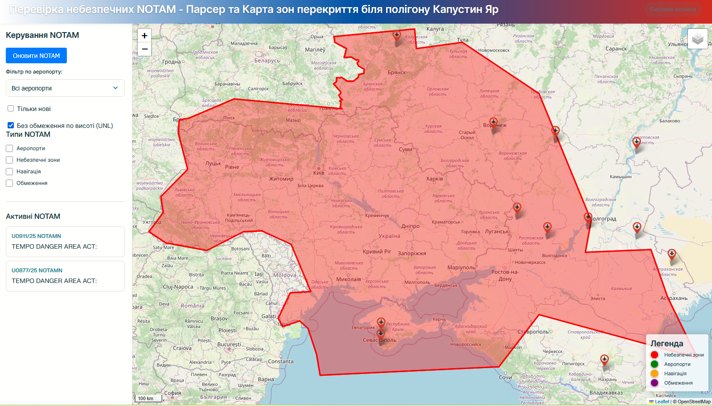

# russian-notam-parser

Цей проект призначений для парсингу, відображення та фільтрації NOTAM (Notice to Airmen) з веб-сервісу FAA DINS. Він дозволяє візуалізувати зони дії NOTAM на карті та надає інструменти для їх фільтрації за різними критеріями. Поки дані беруться лише по аеропорту волгограду, бо він знаходиться біля капустиного яру

## Встановлення

Для роботи проекту не потрібне спеціальне встановлення залежностей, оскільки він використовує стандартні веб-технології (HTML, CSS, JavaScript) та бібліотеку Leaflet, яка підключається через CDN, окрім:
Бібліотеки `requests` для Python. Встановіть її за допомогою pip: 

## Запуск
*   Мати python
*   Встановити `pip install requests`
*   Запустити `python proxy_server.py`
*   Відкрити у браузері сторінку `http://localhost:8000`

## Приклад роботи

